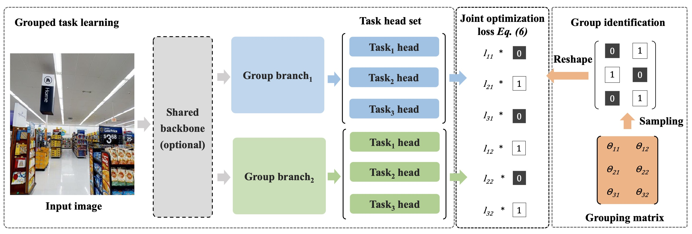

# DMTG: One-Shot Differentiable Multi-Task Grouping
Official PyTorch Implementation of [DMTG](https://arxiv.org/abs/2407.05082). The codes are primarily contributed by [Shuguo Jiang](https://github.com/ShuGuoJ/), [Moran Li](https://github.com/moranli-aca), and [Yuan Gao](https://github.com/ethanygao).

Please refer to our paper for more technical details:
> Yuan Gao, Shuguo Jiang, Moran Li, Jin-Gang Yu, Gui-Song Xia. DMTG: One-Shot Differentiable Multi-Task Grouping, International Conference on Machine Learning (ICML), 2024. [[arXiv]](https://arxiv.org/abs/2407.05082)



If this code is helpful to your research, please consider citing [our paper](https://arxiv.org/abs/2407.05082) by:

```
@inproceedings{dmtg2024,
    title={DMTG: One-Shot Differentiable Multi-Task Grouping},
    author={Yuan Gao and Shuguo Jiang and Moran Li and Jin-Gang Yu and Gui-Song Xia},
    year={2024},
    booktitle = {International Conference on Machine Learning (ICML)}
}
```

## Setup
Install the necessary dependencies:
```bash
pip install -r requirements.txt
```

## Dataset & Checkpoints
Download CelebA from [this website](https://mmlab.ie.cuhk.edu.hk/projects/CelebA/CelebA_Dialog.html):
```bash
python preprocess/preprocess_celeba.py
```

Download Taskonomy from [this website](http://taskonomy.stanford.edu/) (you may not need this if you only want to test our algorithm on CelebA, as the Taskonomy dataset is extremely large): 
```bash
python preprocess/preprocess_taskonomy.py --root {root_path} --nthreads {n_threads} --whitelist {whitelist_path}
```

Our trained checkpoints can be downloaded [here](https://1drv.ms/u/c/7a98ceef6d290667/EXiN-SXGYOhIrRoJ3vJEbMEBBr7GkwaOGf2IrBGUT1I7HA?e=GtGVn2).

## Testing
CelebA:
```bash
python test.py --cfg configs/test/test_celeb_a_9_tasks.yaml --opts run.load_ckpt_dir {2_groups.pth}
```

Taskonomy:
```bash
python test.py --cfg configs/test/test_taskonomy_5_tasks.yaml --opts run.load_ckpt_dir {3_groups.pth}
```

## Training
CelebA:
```bash
CUDA_VISIBLE_DEVICES=0 python -m torch.distributed.launch --nproc-per-node 1 train.py --cfg configs/train_celeb_a/train_celeb_a_100_epoches_2_groups_9_tasks.yaml
```

Taskonomy:  
```bash
CUDA_VISIBLE_DEVICES=0,1 python -m torch.distributed.launch --nproc-per-node 2 train.py --cfg configs/train_taskonomy/train_taskonomy_100_epoches_3_groups_5_tasks.yaml
```
